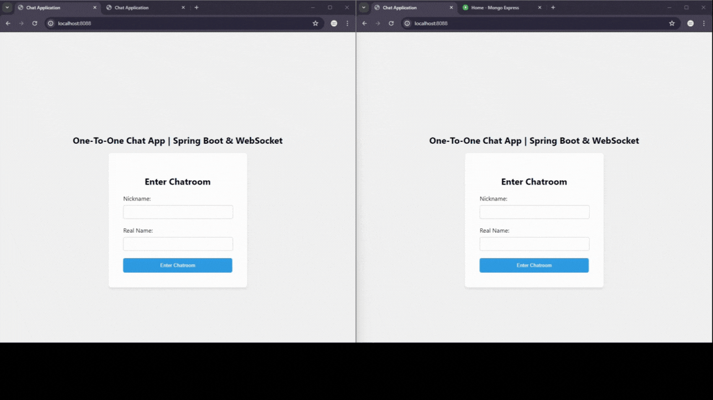

# One-To-One Chat App | Spring - WebSocket

## Tech Stack

### Backend

- **Java** *(v21)*
- **Spring Boot** *(v3.2.5)*
    - **Spring Web**: to build web, including RESTful, apps using **Spring MVC**. Uses **Apache Tomcat** as the default
      embedded container.
    - **WebSocket**: to build Servlet-based WebSocket app with **SockJS** and **STOMP**.
    - **Spring Data MongoDB**: to store data in flexible, JSON-like documents. Meaning fields can vary from document to
      document and data structure can be changed over time.
    - **Lombok**: Java annotation library which helps to reduce boilerplate code.
- **Maven**: build automation and project management tool
- **Docker Compose**: a tool for running multi-container applications on **Docker** defined using the **Compose** file
  format. A **Compose** file is used to define how one or more containers that make up your application are configured.

### Frontend

- **HTML**
- **CSS**
- **JavaScript**

## Showcase

## Diagrams

| **Project Overview**      | **Communication Flow**    |
|---------------------------|---------------------------|
|  |  |

## Reference

A huge shout-out to [Bouali Ali](https://youtube.com/@BoualiAli) for providing [this](https://youtu.be/7T-HnTE6v64)
comprehensive and educative tutorial.